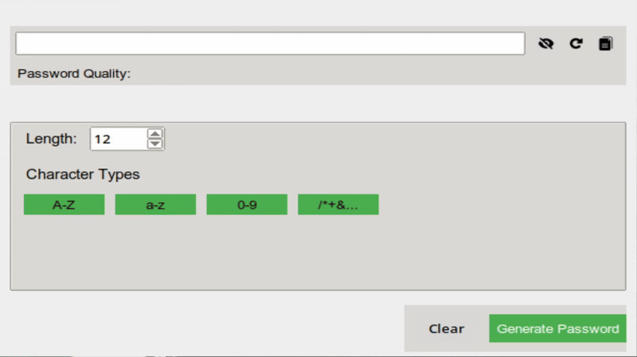

# Password Generator

## Table of Contents

- [Overview](#overview)
- [Features](#features)
- [Requirements](#requirements)
- [Installation](#installation)
- [Usage](#usage)
- [Contributing](#contributing)
- [License](#license)
- [Future Improvements](#Future-Improvements)

[](https://www.python.org/)
[](./LICENSE)

## Overview

Create secure passwords with ease using our customizable password generator application! With features like password strength evaluation and visibility toggle, you'll be able to generate strong passwords in no time.




## Features

- **Generate Passwords** with customizable length and character types
- **Real-time feedback** on password strength
- **Toggle visibility** of generated passwords using eye icons
- Easily **copy generated passwords** to your clipboard
- Customize password length and character types

## Requirements

- Python 3.x
- `tkinter` (usually comes pre-installed with Python)
- `Pillow` (for image handling)

## Installation

### Clone the repository

```
git clone https://github.com/Wayfarerdesert/password-generator.git
```

### Create a Virtual Environment

`python -m venv venv`

On macOS/Linux:

`source venv/bin/activate`

On Windows:

`venv\Scripts\activate`

### To install the required dependencies:

```
pip install pillow
```

# Usage

1. Run the application using python main.py
2. Customize your password generation settings as desired
3. Click "Generate Password" to create a new password

## Contributing

We welcome contributions!

To contribute:

1. Fork this repository using GitHub's fork feature.
2. Create a new branch for your feature or bug fix.
3. Submit a pull request with your changes.

## License

This project is released under the [MIT License](./LICENSE).

## Future Improvements

We have several future improvements planned for this project, including:

1. Advanced ASCII Characters: We plan to add support for advanced ASCII characters, such as non-standard symbols and special characters, to provide even more options for generating unique and secure passwords.
2. Pass Phrase Generator: We also plan to add a pass phrase generator feature, which will allow users to generate secure pass phrases based on words or phrases, providing an additional layer of security and convenience.

These improvements will further enhance the functionality and usability of our password generator application, providing users with even more tools to manage their online security effectively.
